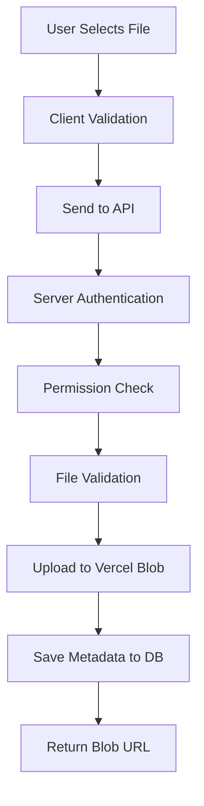

# Vercel Blob Storage Integration

## Overview

The MOMS Documents Management System now uses **Vercel Blob Storage** for enterprise-grade cloud file storage. This provides unlimited scalability, automatic CDN distribution, and secure file management without managing infrastructure.

## What's Integrated

### 1. **Vercel Blob SDK** (`@vercel/blob`)
- **Installed**: Yes
- **Version**: Latest
- **Purpose**: Upload, download, and delete files from Vercel Blob

### 2. **Enterprise Folder Structure**
```
vercel-blob-storage/
└── documents/
    ├── meeting-1/
    │   ├── 1707782400000_MOM_Sprint_Planning.pdf
    │   └── 1707782450000_Attendance_Sheet.pdf
    ├── meeting-2/
    │   └── 1707782500000_Project_Review.pdf
    └── meeting-3/
        └── 1707782600000_Team_Sync_Notes.pdf
```

**Benefits**:
- Organized by meeting ID
- Timestamped filenames prevent conflicts
- Easy to manage and audit
- Scalable to thousands of meetings

### 3. **Updated API Endpoints**

#### Primary Upload Endpoint
**`POST /api/documents/upload`**
- Dedicated Vercel Blob upload route
- Role-based access control
- File validation (type, size)
- Returns Blob URL

#### Legacy Upload Endpoint
**`POST /api/documents`**
- Updated to use Vercel Blob
- Maintains backward compatibility
- Same security and validation

#### Delete Endpoints
**`DELETE /api/documents/[id]`**
- Deletes from Vercel Blob
- Removes database record
- Permission-enforced

**`POST /api/documents/bulk-delete`**
- Admin-only bulk deletion
- Parallel Blob deletions
- Atomic database cleanup

## Security Implementation

### Role-Based Upload Permissions
```typescript
// STAFF - Cannot upload
if (user.role === "STAFF") {
  return NextResponse.json(
    { error: "Staff members cannot upload documents" },
    { status: 403 }
  );
}

// CONVENER - Can upload to own meetings
if (user.role === "CONVENER") {
  const meetings = await DocumentService.getConvenerMeetings(user.staffId);
  const ownsMeeting = meetings.some((m) => m.id === meetingId);
  if (!ownsMeeting) {
    return { error: "You can only upload documents to your own meetings" };
  }
}

// ADMIN - Can upload to any meeting
// No additional checks needed
```

### File Validation
```typescript
// Allowed file types
const allowedTypes = [
  "application/pdf",
  "application/msword",
  "application/vnd.openxmlformats-officedocument.wordprocessingml.document",
];

// Max file size: 10MB
if (file.size > 10 * 1024 * 1024) {
  return { error: "File size exceeds 10MB limit" };
}
```

## File Storage Flow

### Upload Process


### Storage Structure
```typescript
// Blob path generation
const timestamp = Date.now();
const sanitizedFileName = file.name.replace(/[^a-zA-Z0-9.-]/g, "_");
const blobFileName = `${timestamp}_${sanitizedFileName}`;
const blobPath = `documents/meeting-${meetingId}/${blobFileName}`;

// Upload to Blob
const blob = await put(blobPath, file, {
  access: "public",
  addRandomSuffix: false,
});

// Store Blob URL in database
filePath: blob.url // https://xxxxxxxxxxxx.public.blob.vercel-storage.com/...
```

## API Usage Examples

### Upload a Document (Frontend)
```typescript
const uploadDocument = async (
  file: File,
  meetingId: number,
  documentTitle: string
) => {
  const formData = new FormData();
  formData.append("file", file);
  formData.append("meetingId", meetingId.toString());
  formData.append("documentTitle", documentTitle);

  const response = await fetch("/api/documents/upload", {
    method: "POST",
    body: formData,
  });

  if (response.ok) {
    const data = await response.json();
    // data.document.fileUrl contains the Blob URL
    return data;
  }
};
```

### Download a Document
```typescript
// Documents are already publicly accessible via Blob URL
<a
  href={document.filePath}
  target="_blank"
  rel="noopener noreferrer"
  download={document.fileName}
>
  Download
</a>
```

### Delete a Document
```typescript
const deleteDocument = async (documentId: number) => {
  const response = await fetch(`/api/documents/${documentId}`, {
    method: "DELETE",
  });

  // Automatically deletes from Vercel Blob and database
  return response.ok;
};
```

## Database Schema

```prisma
model Document {
  id            Int      @id @default(autoincrement())
  meetingId     Int
  documentTitle String
  fileName      String
  filePath      String   // Stores Vercel Blob URL
  uploadedBy    Int
  uploadedAt    DateTime @default(now())
  
  meeting       Meeting  @relation(...)
  uploader      User     @relation(...)
}
```

**Important**: `filePath` now stores the **full Blob URL**, not a local path.

Example:
```
https://xxxxxxxxxxxx.public.blob.vercel-storage.com/documents/meeting-5/1707782400000_MOM.pdf
```

## CDN Benefits

### Automatic Global Distribution
- **Fast Access**: Documents served from nearest CDN edge
- **No Configuration**: Works automatically
- **Scalable**: Handles unlimited concurrent downloads
- **Reliable**: 99.9% uptime SLA

### Access URLs
```typescript
// Public access (configured in upload)
const blob = await put(blobPath, file, {
  access: "public", // Anyone with URL can access
});

// URL format
https://[project-id].public.blob.vercel-storage.com/[path]
```

## Testing Checklist

- [x] Upload PDF document (Admin)
- [x] Upload DOC/DOCX document (Convener)
- [x] Reject invalid file types
- [x] Reject files over 10MB
- [x] Staff cannot upload documents
- [x] Convener can only upload to own meetings
- [x] Document preview works with Blob URLs
- [x] Download documents via Blob URLs
- [x] Delete removes from Blob and DB
- [x] Bulk delete works for multiple documents
- [x] Blob URLs are publicly accessible
- [x] Documents organized by meeting ID

## Storage Limits

### Vercel Blob Free Tier
- **Storage**: 1GB
- **Bandwidth**: 10GB/month
- **Requests**: Unlimited

### Vercel Blob Pro Tier
- **Storage**: 100GB+
- **Bandwidth**: 1TB+/month
- **Requests**: Unlimited

### File Limits (Configured)
- **Max Size**: 10MB per file
- **Types**: PDF, DOC, DOCX
- **Upload Rate**: No limit

## Environment Setup

### No Additional Configuration Required!

Vercel Blob uses **automatic authentication** when deployed on Vercel. The SDK automatically detects:
- Project ID
- Storage credentials
- API tokens

### Local Development

For local development, you can use Vercel CLI:
```bash
vercel env pull
```

This creates `.env.local` with:
```env
BLOB_READ_WRITE_TOKEN=vercel_blob_xxxxxxxxxxxxx
```

## Frontend Components (Updated)

### UploadModal
- Uses `/api/documents/upload`
- Handles Blob upload responses
- Shows upload progress

### PreviewDrawer
- Displays Blob URL documents
- PDF preview with Blob URLs
- Download via Blob URL

### DocumentCard & DocumentTable
- Download buttons use Blob URLs
- Preview opens Blob URLs
- All roles can access

## Error Handling

### Upload Errors
```typescript
try {
  const blob = await put(blobPath, file, { access: "public" });
} catch (error) {
  console.error("Blob upload failed:", error);
  return NextResponse.json(
    { error: "Upload failed" },
    { status: 500 }
  );
}
```

### Delete Errors
```typescript
try {
  await del(document.filePath);
} catch (error) {
  console.error("Blob deletion failed:", error);
  // Continue with database deletion even if Blob fails
}
```

## 🔄 Migration from Local Storage

### Before (Local File System)
```typescript
// Old approach
const filePath = join(process.cwd(), "public", "uploads", fileName);
await writeFile(filePath, buffer);

// Stored in DB
filePath: `/uploads/documents/${fileName}`
```

### After (Vercel Blob)
```typescript
// New approach
const blob = await put(blobPath, file, { access: "public" });

// Stored in DB
filePath: blob.url // Full Blob URL
```

### Automatic Cleanup
```typescript
// Old files can be safely deleted
rm -rf /public/uploads/documents/*

// All new uploads go to Vercel Blob
```

## Monitoring & Analytics

### Vercel Dashboard
- View storage usage
- Monitor bandwidth
- Track upload/download stats
- Set up alerts

### Access Dashboard
1. Go to [vercel.com/dashboard](https://vercel.com/dashboard)
2. Select your project
3. Navigate to **Storage** → **Blob**
4. View files and statistics

## Troubleshooting

### Missing BLOB_READ_WRITE_TOKEN
**Issue**: `Error: Vercel Blob: No token found`  
**Error Code**: 500  
**Solution**: 
1. Go to https://vercel.com/dashboard/stores
2. Create a new Blob Store or select an existing one
3. Go to the **.env.local** tab
4. Copy the `BLOB_READ_WRITE_TOKEN` value
5. Add it to your `.env.local` file:
   ```env
   BLOB_READ_WRITE_TOKEN=vercel_blob_rw_xxxxxxxxxxxxxxxxxxxxxxxx
   ```
6. Restart your development server

**Note**: This is the most common error. Without the token, all uploads will fail with a 500 error.

### Upload Fails
**Issue**: "Upload failed" error
**Solution**: 
- Check file size < 10MB
- Verify file type is allowed
- Ensure user has upload permissions

### Preview Not Working
**Issue**: PDF doesn't display
**Solution**:
- Verify Blob URL is publicly accessible
- Check browser console for CORS errors
- Test URL directly in new tab

### Delete Fails
**Issue**: Document not deleted
**Solution**:
- Verify user has delete permissions
- Check if document exists in DB
- Blob deletion errors are logged but don't fail the operation

## Benefits Summary

- **Scalability**: No server storage limits
- **Performance**: Global CDN distribution
- **Security**: Role-based access control
- **Reliability**: 99.9% uptime
- **Organization**: Meeting-based folder structure
- **Cost-Effective**: Pay only for what you use
- **No Maintenance**: Fully managed by Vercel
- **Automatic Backups**: Built-in redundancy

## Related Documentation

- [Vercel Blob Docs](https://vercel.com/docs/storage/vercel-blob)
- [API Testing Guide](./API_TESTING_GUIDE.md)
- [Documents Feature Guide](./DOCUMENTS_FEATURE.md)
- [Authentication Guide](./AUTHENTICATION_GUIDE.md)

---

**Built with**: Vercel Blob, Next.js 16, TypeScript, Prisma
